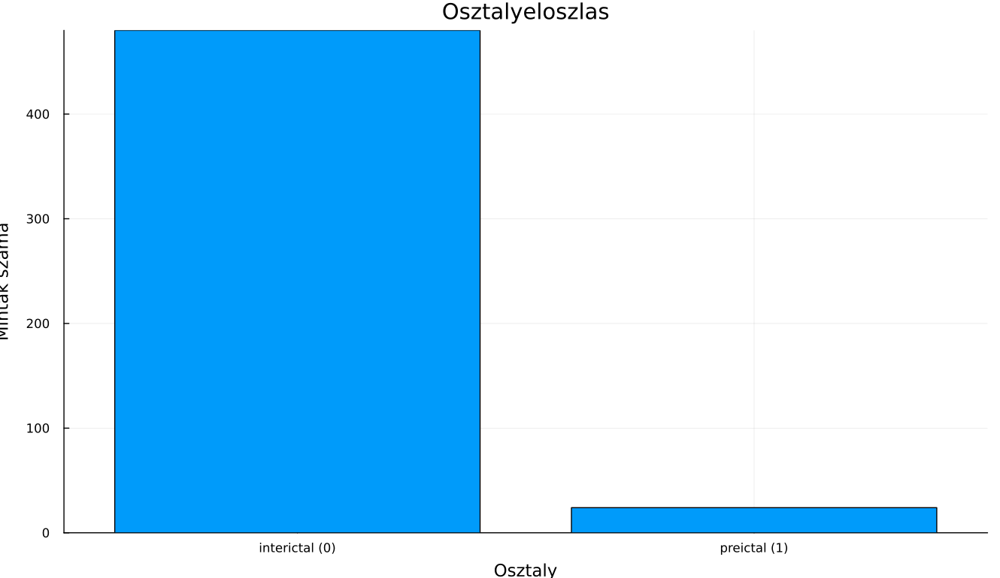
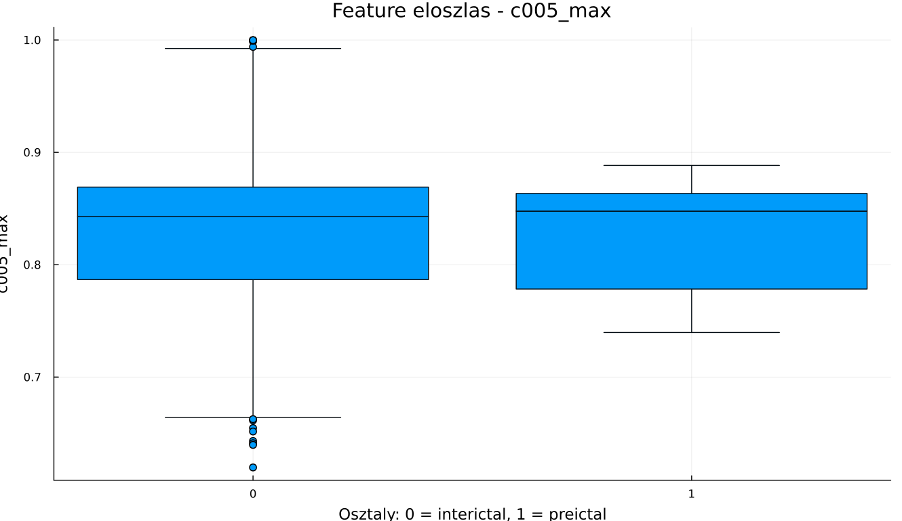
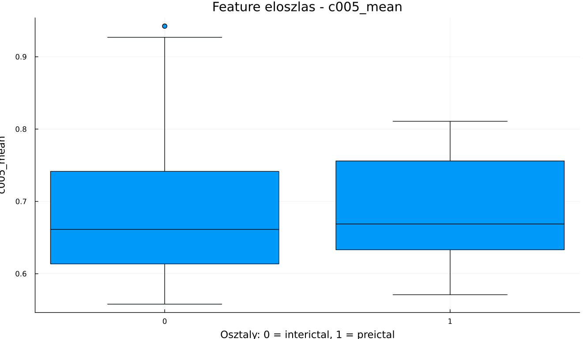
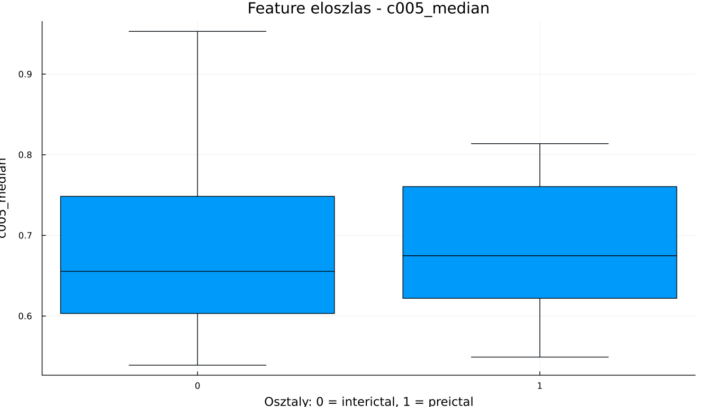
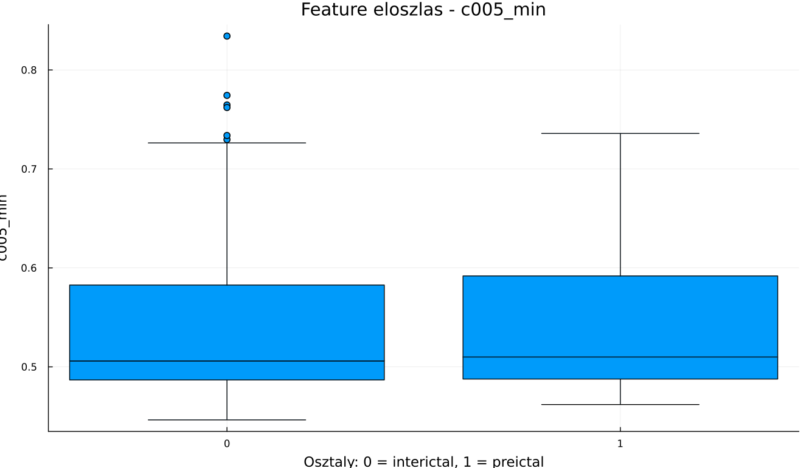
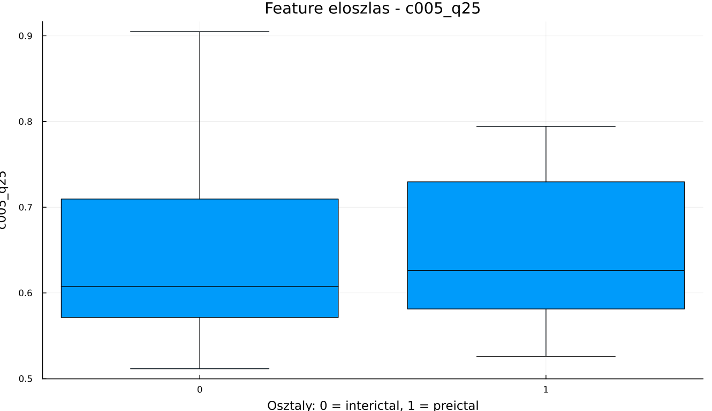
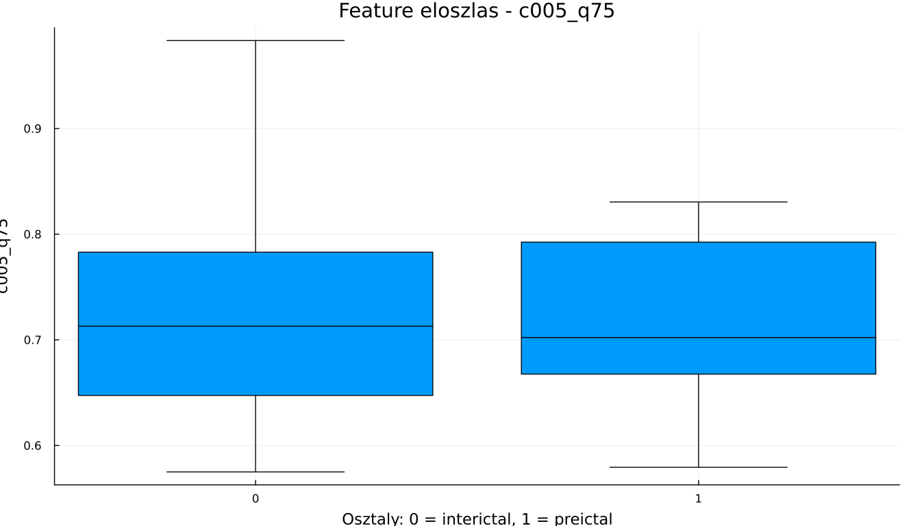
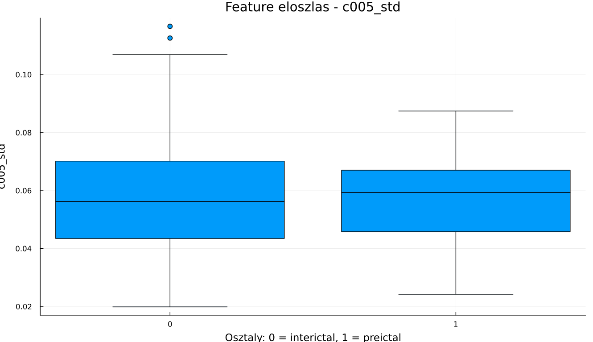

# EEG-Based-Epileptic-Seizure-Detection
The goal is to detect the onset of an epileptic seizure as effectively as possible.

## Project Overview

The aim of this project is to predict epileptic seizure onset as accurately and effectively as possible using EEG (electroencephalography) signals and machine learning techniques.

Epileptic seizures often occur suddenly, which makes early detection and prediction highly important. In this project, we investigate whether EEG data contains patterns that can help identify seizure-related activity before the actual seizure begins.

## Objective

The main goal of this project is to build a machine learning model that can distinguish between different brain states based on EEG recordings, with a particular focus on predicting seizure onset.

More specifically, we want to determine whether EEG segments can be classified into categories such as:

- normal brain activity
- pre-seizure activity
- seizure activity

By doing this, we aim to create a system that can support earlier warning and better understanding of epileptic events.

## Method

In this project, we use **Support Vector Machine (SVM)** as the main classification algorithm.

Since raw EEG signals are complex and noisy, they are not directly used as input for the model. Instead, the signals are first processed and transformed into meaningful numerical features. This step is important because the quality of the extracted features strongly affects the performance of the SVM model.

Examples of extracted features may include:

- mean
- standard deviation
- signal energy
- frequency band power
- entropy-based features
- channel correlation measures

These features are then used to train the SVM model to classify EEG segments into the appropriate categories.

## Workflow

The main steps of the project are:

1. Load EEG data
2. Preprocess and clean the signals
3. Segment the signals into time windows
4. Extract relevant features
5. Train the SVM classifier
6. Evaluate the model performance

## Expected Outcome

By the end of this project, we aim to:

- build a working EEG classification model
- evaluate the effectiveness of SVM for seizure prediction
- identify which features are the most useful for distinguishing seizure-related patterns
- analyze the strengths and limitations of this approach

## Evaluation Metrics

The model will be evaluated using common classification metrics such as:

- Accuracy
- Precision
- Recall
- F1-score
- ROC-AUC

## Why This Project Matters

Early prediction of epileptic seizures can be very valuable for improving patient safety and quality of life. A reliable prediction system could contribute to future real-time warning systems and decision-support tools in medical applications.

## Future Work

Possible future improvements include:

- testing additional feature extraction methods
- comparing SVM with other machine learning models
- applying deep learning approaches
- exploring patient-specific prediction models

# Ez az ábra azt szemlélteti, hogy hány interiktális és hány preiktális teszt adatot sikerült helyesen prediktálni.

# Ezek azt mutatják, hogy egy adott elektródát tekintve mind preiktális, mind pedig interiktális minta esetén mennyiben tér el az adott feature érték

A fenti képen a confusion mátrix látható, amely klasszifikálja a tesztelési mintákat, aszerint, hogy ezt mennyire pontosan találta el, vagyis "true positive", "true negative", "false positive", "false negative". A képen minél sötétebb a  téglalap, annál gyakrabban esett abba a katergóriába.
Pred 1 + True 1 = true positive, Pred 1 + True 0 = false positive, stb,,,

Ezen a heatmap-en az interictális standardizált feature-ök jelennek meg, rajta látjató, hogy vannak-e feature mintázatok, amelyek osztályok szerint elválnak.

A PCA projekció pedig a sokdimenziós adatokat 2D-re vetíti le. PC1 szerinti interictális, illetve preictális mintákat ábrázolja. Látható, hogy ezek nem szeparálhatóak lineárisan, vagyis túlságosan hasonlóak a minták (adott feature szerint).

Ezen a heatmap-en látszik a permutation fuzzy entropy kimenete a legelső interictális bemeneti állománynak, vagyis az adott bemeneti mátrix PFE-átalakítás után. Látható, hogy vannak csatornák, amelyek időben nagoyn más PFE mintát mutatnak.

Hasonlóan, de ebben az esetben a legelső preictális bemenetet vizsgáljuk.

A fenti ábra megmutatja, hogy hogyan néz ki egy általános interictális bemenet.

Ez pedig hasonlóan, egy általános preictális bemeneti jel.

Ezen az ábrán az első 20 legeltérőbb bemeneti minta van ábrázolva. Az eltérést az interictális és preictális minták között vizsgáltuk. Látszik, hogy legfenneb ~0.02, vagyis parányi 2% eltérést tudtunk észlelni.
